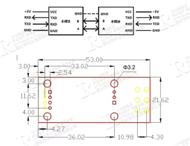

# ESP32C3下位机驱动程序

## 一、基本介绍

### 本程序使用ESP32C3的功能

- （1）通过`BLE`（低功耗蓝牙），向上位机发送当前监测传感器的实时数值，
包括`氨气`、`氮氧化物（NO和NO2）`、`臭氧`三种，及`温湿度`；
    
- （2）驱动0.96寸OLED小屏显示数值。

### 本装置用到的硬件

- 核心电路板：安信可公司 ESP-C3-32S-kit 3297
- 温湿度传感器：`DHT11`，量程湿度`5~95%RH`， 温度`-20~60℃`，驱动电压与单片机逻辑电平相同（`5V`/`3.3V`）
- `0.96`寸OLED小屏：型号`SSD1306`，分辨率`128*64`，驱动电压`3.3V`
- 氨气传感器：`0-1000ppm`，分辨率是`0.1ppm`，驱动电压`5V`，下同
- 臭氧传感器：`0-100ppm`，分辨率`0.01ppm`
- 一氧化氮传感器：`0-2000ppm`，分辨率是`0.1ppm`
- 二氧化氮传感器：`0-2000ppm`，分辨率是`0.1ppm`

后四个有害气体传感器采购自精讯畅通厂家直销店，负责人为魏经理，售后为刘工。各个硬件的详细引脚定义见技术手册。

### 本程序用到的样例

全部引用样例如下，部分样例在工程目录文件下有备份。

- 乐鑫Arduino-ESP32仓库的示例代码 BLE_uart
- ThingPulse公司`ESP8266 and ESP32 OLED`库的OLED样例代码 SSD1306SimpleDemo
- Layada的DHT驱动库 DHTteste
- CSDN社区@cyw_2018 ESP32多线程
- CSDN社区@xiaoshihd ESP32+RS485测量教程
- CSDN社区@青睚白鹿 ESP32连接RS485土壤湿度传感器上传至MySQL

参考链接分别为：

- https://github.com/espressif/arduino-esp32
- https://github.com/ThingPulse/esp8266-oled-ssd1306
- https://github.com/adafruit/DHT-sensor-library
- https://blog.csdn.net/qq_41595493/article/details/109710067
- https://blog.csdn.net/xiaoshihd/article/details/109398264
- https://blog.csdn.net/weixin_42618434/article/details/116019430

其中，DHT的包正常运行需要依赖于Adafruit的Unified Sensor Lib: 
- https://github.com/adafruit/Adafruit_Sensor

## 二、环境配置

### Arduino

Arduino IDE开发ESP32的环境配置：

- 开发板网址加入 https://raw.githubusercontent.com/espressif/arduino-esp32/gh-pages/package_esp32_index.json

- 搜索ESP32，安装此包。本程序基于**2.0.2**版本开发，其兼容**v4.4**的ESP-IDF。

### DHT传感器

DHT传感器的硬件连线和定义：

``` C++
#define DHTTYPE DHT11   // DHT 11
#define DHTTYPE DHT22   // DHT 22  (AM2302), AM2321
#define DHTTYPE DHT21   // DHT 21 (AM2301)
```

将传感器有孔道的那一面对着自己，最左边的是VCC，最右边是GND，左数第二个是数据引脚。VCC与逻辑电平TTL相同，ESP32逻辑电平为5V

### OLED小屏

OLED小屏背后有地址选址的电阻，提供两个不同地址位选择。目测测试物理地址位与程序地址位不相符，地址位为`0x3c`。

OLED声明定义：

``` C++
// Include the correct display library

// For a connection via I2C using the Arduino Wire include:
#include <Wire.h>               // Only needed for Arduino 1.6.5 and earlier
#include "SSD1306Wire.h"        // legacy: #include "SSD1306.h"
OR #include "SH1106Wire.h"   // legacy: #include "SH1106.h"

// For a connection via I2C using brzo_i2c (must be installed) include:
#include <brzo_i2c.h>        // Only needed for Arduino 1.6.5 and earlier
#include "SSD1306Brzo.h"
OR #include "SH1106Brzo.h"

// For a connection via SPI include:
#include <SPI.h>             // Only needed for Arduino 1.6.5 and earlier
#include "SSD1306Spi.h"
OR #include "SH1106SPi.h"
```

OLED初始化与连线：

```C++
// Initialize the OLED display using Arduino Wire:
SSD1306Wire display(0x3c, SDA, SCL);   // ADDRESS, SDA, SCL  
SSD1306Wire display(0x3c, D3, D5);  // ADDRESS, SDA, SCL  -  If not, they can be specified manually.
SSD1306Wire display(0x3c, SDA, SCL, GEOMETRY_128_32); 
                                    // ADDRESS, SDA, SCL, OLEDDISPLAY_GEOMETRY  -  Extra param required for 128x32 displays.
SH1106Wire display(0x3c, SDA, SCL);     // ADDRESS, SDA, SCL

// Initialize the OLED display using brzo_i2c:
SSD1306Brzo display(0x3c, D3, D5);  // ADDRESS, SDA, SCL
or
SH1106Brzo display(0x3c, D3, D5);   // ADDRESS, SDA, SCL

// Initialize the OLED display using SPI:
D5 -> CLK
D7 -> MOSI (DOUT)
D0 -> RES
D2 -> DC
D8 -> CS
SSD1306Spi display(D0, D2, D8);  // RES, DC, CS
or
SH1106Spi display(D0, D2);       // RES, DC
```

OLED常用基本函数：

```C++
// clear the display 清空已有显示
display.clear();

// create more fonts at http://oleddisplay.squix.ch/
display.setTextAlignment(TEXT_ALIGN_LEFT); // 显示位置，可选参数包括LEFT，RIGHT和CENTER，详见同目录下OLED示例程序
display.setFont(ArialMT_Plain_16); // 设置字体和字体大小，尾数即为字体大小
display.drawString(0, 0, "temp: " + String(temperature) + "°C"); // 前两个参数为绘制文本的起始位置的x，y坐标

// write the buffer to the display
display.display(); // 将上述函数构成
```

本项目选择的是四引脚的OLED小屏，使用I2C总线通信，使用的地址位是0x3c，使用第一种初始化方式。

后续的SDA和SCL引脚在开发板提供者的引脚定义头文件中写明，pins_arduino.h 对于ESP32C3，两个引脚分别为引脚是**8（SDA）**和**9（SCL）**，分别对应**GPIO8**和**GPIO9**。

- Ref: https://github.com/espressif/arduino-esp32/blob/master/variants/esp32c3/pins_arduino.h

**值得注意**的是，Arduino中ESP32的GPIO口的标号对应其在程序中调用的数字。

### 有害气体传感器

使用TTL通信或485通信，波特率2400/4800/9600可选，出厂默认9600。外部设置金属网对电磁干扰进行屏蔽。使用modbus-RTU通信协议，与ESP通信须使用485转TTL模组，具体通信格式见通信协议。

#### 传感器使用注意事项：

- 不要直接焊接模组的插针，可以焊接插针的管座
- 不可经受过度撞击和震动
- 对于氮氧化物传感器（尤其是一氧化氮传感器），**初次上电使用需预热五分钟以上，在示数为零后方可使用**
- **不可长时间暴露于高浓度下污染空气，不可长时间超量程使用，使用后务必排空污染气体，在空气载气条件下保存，否则损害传感器寿命**

#### 与传感器的通信：

与传感器的通信使用软串口通信，在ESP8266中须引用`<SoftwareSerial.h>`头文件，在ESP32中不须引用头文件，已经默认在core中编译了头文件`<HardwareSerial.h>`，在代码中引用会报错。ESP的串口可以另外指定引脚，而不一定强制使用官方封装的引脚；但8266和32的引脚声明又略有区别。

在ESP8266中定义如下，`SoftwareSerial`类的初始化传入参数包括了TTL通信的两个引脚。

```C++
#include <SoftwareSerial.h>
SoftwareSerial tempSerial(8, 7);  // RX, TX，注意顺序
```

8266的软串口使用：

```C++
void setup()
{
  tempSerial.begin(9600);
}

void loop()
{
    tempSerial.listen();  // 监听温度串口
    for (int i = 0 ; i < 8; i++) {  // 发送测温命令
        tempSerial.write(tempCommand[i]);   // write输出
    }
    delay(100);  // 等待测温数据返回
    tempData = "";
    while (tempSerial.available()) {//从串口中读取数据
        uint8_t in = (uint8_t)tempSerial.read();  // read读取, unsigned char define成 uint8_t
        Serial.print(in, HEX);
        Serial.print(',');
        tempData += in;
        tempData += ',';
    }
    tempSerial.end();
}
```
其中，开始监听的`listen`函数和`end`函数可不写，且是ESP8266独占函数，在ESP32中不可使用。

ESP32中定义如下，传入参数`1`表明板子上总共有几路可使用的串口通信引脚。

```C++
// #include <HardwareSerial.h> // 引用的头文件，可以在他的cpp里看具体的函数接口定义
HardwareSerial mySerial1(1); //软串口，用来与传感器进行通信
```

在ESP中，不可在这一步中指定使用别的引脚，需要在串口启动函数中才能另外指定。初始化参数的数字`1`告诉编译器除了烧录用的串口之外，还有几条软串口。但实际上这里对于不同的硬件仅能指定特定值，否则会报错。对于ESP32C3，仅有1条软串口。

```C++
mySerial1.begin(4800,SERIAL_8N1,35,12); 
```

对于具体的参数进行说明：

- `4800`：波特率
- `SERIAL_8N1`：表设置`config`，表示8位数据位，无校验位，1位停止位。
- 后两个参数分别为`rxPin`和`txPin`的引脚标号

本装置中使用的`TX`、`RX`的引脚与ESP32C3官方封装的串口通信引脚一致，为`IO19`（`TX`）和`IO18`（`RX`）；`config`表示数据位校验位停止位的参数，应当赋值`SERIAL_8N1`。上面后两个参数不需要特别说明，`TX`和`RX`默认值均已在头文件里写好。

具体的读写方式与上面ESP8266除了不需要`listen`和`end`之外完全一致。对`HardwareSerial`的常用库函数进行说明。

`HardwareSerial`头文件中定义的常用库函数包括启动函数、读写函数、可读写字节数函数等。

- 启动函数`begin()`中可指定主要参数有波特率、串口设置、RX引脚和TX引脚；其中波特率必须指定，否则报错，而`config`串口设置并未在头文件中见默认值，应当设为`SERIAL_8N1`（8位数据位，无校验位，1位停止位）。

- 读写函数`read()`和`write()`均为复用函数，可每次读写单个无符号字节，也可以指定一个字符串的指针和要读写的长度，读取的值会直接返回到字符串里，适用于固定长度的读写。目前测试写函数大约8个CPU时间即可使一个写字节出栈，而读函数也不必像8266那样在每个字节中设置延时2毫秒，直接无缝读串口便可全部读出。

- 可读写字节对于读写函数分别是`available()`和`availableForWrite()`，返回一个整型数，表明当前写的缓冲区的剩余大小或读缓冲区的占用字节个数。对于ESP32C3，写缓冲区的大小为128个字节。


#### 485转TTL模组

可能使用的是MAX485芯片为核心的电路，一侧是`VCC`+`GND`+`TX`和`RX`，另一侧接485，是`GND`和`485-A`与`485-B`。芯片`TX`接ESP单片机`RX`，芯片`RX`接ESP的`TX`，而485则是芯片与设备A与A相连，B与B相连。使用前注意型号是否一致。



## 三、编程注意事项

### 蓝牙BLE_uart

新建蓝牙的步骤为：

```C++
/*
   Ported to Arduino ESP32 by Evandro Copercini

   The design of creating the BLE server is:
   1. Create a BLE Server
   2. Create a BLE Service
   3. Create a BLE Characteristic on the Service
   4. Create a BLE Descriptor on the characteristic
   5. Start the service.
   6. Start advertising.
*/
```

需要指定蓝牙的设备唯一ID和他的发信收信通道ID：

```C++
#define SERVICE_UUID           "6E400001-B5A3-F393-E0A9-E50E24DCCA9E" // UART service UUID
#define CHARACTERISTIC_UUID_RX "6E400002-B5A3-F393-E0A9-E50E24DCCA9E" // 收信
#define CHARACTERISTIC_UUID_TX "6E400003-B5A3-F393-E0A9-E50E24DCCA9E" // 发信
```

使用网址 https://www.uuidgenerator.net/ 生成唯一的蓝牙地址

需要引用的头文件和初始化的类包括：

```C++
#include <BLEDevice.h>
#include <BLEServer.h>
#include <BLEUtils.h>
#include <BLE2902.h>
// #include <string.h> 

BLEServer *pServer = NULL;
BLECharacteristic * pTxCharacteristic;
bool deviceConnected = false; // 当前有无设备连接
bool oldDeviceConnected = false; // 是否已经有设备连接

class MyServerCallbacks: public BLEServerCallbacks {} // 设备状态更改
class MyCallbacks: public BLECharacteristicCallbacks {} // 收信响应类
```

更具体的操作请看样例代码。

其他注意事项：

- ESP蓝牙模块读写不支持Arduino的`String`关键字，仅可以使用C++自带的`<string.h>`头文件里的`string`类型，调用时须指明是`std`命名空间里的，如`std:string`

### OLED驱动

因为OLED不可以无限制快速刷新，每次刷新中间需要时间间隔，因此将其放在单独的线程中刷新。

#### ESP的线程

使用封装的函数`xTaskCreate`。示例代码：

```C++
xTaskCreate(
    taskOne,   /* Task function. */
    "TaskOne", /* String with name of task. */
    10000,     /* Stack size in bytes. */
    NULL,      /* Parameter passed as input of the task */
    1,         /* Priority of the task. */
    NULL       /* Task handle. */
);
```

第一个参数为要在线程中执行的函数的函数名，第三个参数为给该线程分配的栈的字节数（即内存大小），第五个参数为优先级。当第四个参数，传入函数的参数，设定为`NULL`时，相对应的函数应当写明函数不接受任何参数，如下：

```C++
void taskOne(void *parameter) {}
```

应特别注明接受参数为`void *parameter`，而写作`void`不够严格，在编译器里会报错。

### DHT驱动

DHT不可写在线程里，必须在主线程中不断循环，且其采样时间不随外部输入时间确定。

---

## FAQ

---

### 两条I2C的配置

I2C在Arduino中配置第二条总线
- Ref：https://blog.csdn.net/qq_33685823/article/details/113796309

### OLED小屏

屏幕背后烧的电阻给的地址位是0x78，但是程序里面的地址位是0x3c，奇怪的是程序烧进去的地址可以驱动OLED小屏，而将地址改成0x78之后就不能驱动小屏了。

单色图绘图工具：
- https://blog.squix.org/2015/05/esp8266-nodemcu-how-to-create-xbm.html

### DHT11

1. 由于DHT温湿度传感器是一个非常非常慢的传感器，在主循环中需要2秒的时间才可以完成一次完整的读取温湿度的操作。因此，为了尽量提高读取成功率，本程序每次读取DHT传感器的时间间隔为3000毫秒。

2. 传感器对于湿度的下降非常不敏感，上升反应还是比较快的。

3. 他的读写收到环境因素的强烈干扰和未知的随机因素影响，存在长时间无法正常读取温湿度的情况。

4. DHT读写类在ESP线程中无法正常工作，会出现无法避免的丢包情况。

### Arduino的宏定义F()

Arduino中F函数对字符串的操作

首先纠正一点，`F()`不是函数，而是宏定义，简单点说：

    程序存储空间（也就是文中的flash memory），是用来存放程序的；

    动态存储空间（也就是文中的dynamic memory），是用来存放变量的；

有时候，dynamic memory不够用了，那么使用`F()`宏，把原来需要存放到dynamic memory中的内容，修改为存放到flash memory中。所以使用`F()`宏后，会导致占用更多的flash memory。

通俗点说，当你写程序的时候弄了很多全局变量，编译的时候会提示你占用了多少空间可能会造成不稳定什么的。这时候可以把所有的`serial.print`里面加上`F()`，这样可以节省全局变量。

### ESP多线程

补充上述`void* parameter`的部分：

    invalid conversion from 'void (*)()' to 'TaskFunction_t' {aka 'void (*)(void*)'} [-fpermissive]

使用ESP32的多线程报错，在使用xTaskCreate()创建任务时，报了上述错误，是因为：

任务函数的参数格式不能写作

    Task_example()

在C++里，函数`()`表示可以接收任何形式的参数，而函数`(void* Parameter)`才是什么参数都不接受。上述方案仅适用于任务函数不需要外部参数输入的情况。

### ESP-IDF环境安装和配置

#### 从Git上clone **（不推荐）**

（1）从Windows迁移到macOS下的文件在终端中运行报 

    env: bash\r: No such file or directory

是因为两个系统的文件名管理策略有区别，需要运行以下命令；

    1、brew install dos2unix
    2、find . -type f -exec dos2unix {} \;

（2）idf.py build之后报

    env: idf.py: Permission denied

去idf.py目录下执行

    chmod u+x ./idf.py

如果其他如export.sh也报这个问题也执行一下就好了。

#### 解压压缩包 **（推荐）**

- Ref: https://backmountaindevil.github.io/#/hackaday/esp32/espidf

#### 环境配置

VScode打开源文件头文件报错找不到，在includePath内加入下述设置，具体目录根据自己安装位置自行调整。

    "/opt/esp/esp-idf-v4.4/components/**"

在包含ESP-IDF的components文件夹之后剩余的头文件（如

    cannot open source file "sys/reent.h" (dependency of "freertos/FreeRTOS.h")

）报错解决方法：

    "C_Cpp.intelliSenseEngine": "Tag Parser"

向setting.json文件夹末尾追加上述设置。

- Ref：https://github.com/espressif/vscode-esp-idf-extension/issues/618 

### Git ignore跟踪问题

Gitignore不生效：在工程目录下运行：

    1.	git rm -r --cached .
    2.	git add .
    3.	git commit -m "update .gitignore"

### ESP的TTL串口

对于每一块ESP32的开发板，都有至少两组TTL串口引脚（TX和RX）。其中，对于ESP32C3，其封装管脚示意图上明确指出的TX和RX引脚（U0RX和U0TX，IO20/IO21）是系统烧录的串口引脚，在系统头文件HardwareSerial.h里名称为SOC_TX和SOC_RX，赋值分别为21和20。这对引脚是与板载USB转TTL的线路直接相连，当电脑向单片机烧录时，即通过这两个引脚进行操作。若将单片机的这两个引脚引出，例如接到485转TTL上，上位机会优先烧录引脚上连接的外部设备，在等待连接的过程中，板载与IO19相连的冷色LED灯会均匀呼吸闪烁，上位机会提示：

    A fatal error occurred: Timed out waiting for packet header

或者提示是否串口上连接了多个设备：

    raise SerialException('device reports readiness to read but returned no data (device disconnected or multiple access on port?)')
    serial.serialutil.SerialException: device reports readiness to read but returned no data (device disconnected or multiple access on port?)

也因此，在Arduino IDE里向设备发送数据时，485转TTL模块里收发信指示灯并未亮起，而调用Serial接口向上位机发送数据，串口打印文本信息时，则会亮起。

对于ESP32C3，除了系统烧录的串口引脚之外，有且只有另一组串口引脚可以用来当做软串口（对于ESP32，可能叫硬串口会更合适），在系统头文件中分别定义为RX1和TX1，分别为IO19和IO18。ESP32为串口通信封装了指示灯，对于ESP32C3，冷色灯挂载在IO19上，暖色灯挂载在IO18上，由于传输数据的本质是通过对引脚电平的拉高和拉低，引脚上的电平会直接影响到这组板载LED等的亮度，传输数据就会引起LED闪烁，因此这组LED灯起到了通信指示灯的作用。

先前冷色灯过亮，因此我代码里用TTL输出将IO19默认置低电平。当接线从系统串口迁移到这组软串口时，最初我的接线仍然接错了，接成了TX-TX，RX-RX，此时485转TTL模块上TX线路的指示LED常亮，串口输出大量乱码。取消置低电平后，冷光灯常亮，485转TTL模块熄灭并转为闪烁。然后发现接线错误，将接线交换后，变为暖光灯常亮，并偶见闪烁，冷光灯熄灭。不清楚内部接线以及电平之间的关系，灯的亮灭可能与LED方向也有关系。目前认为，RX引脚被拉低即为接收状态，TX拉低为发送状态；TX接的对面的RX为高电压时，表示无数据传送，对面也没有处于接收数据状态；RX对面的TX同理。现在不好的就是暖色灯也总是处于过亮的状态了。


